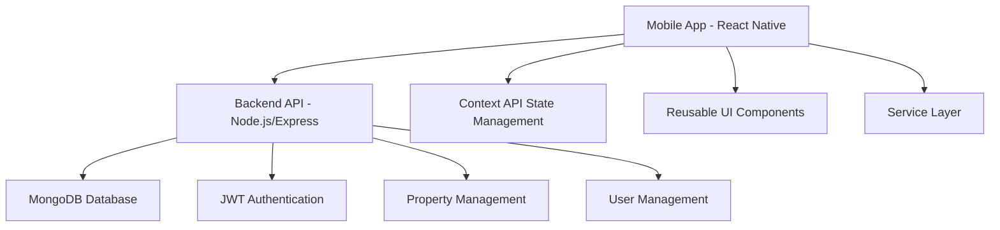
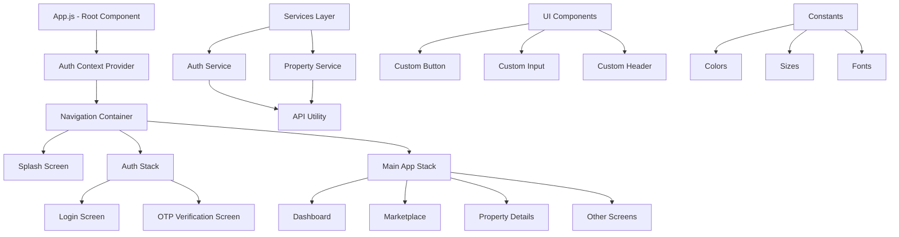
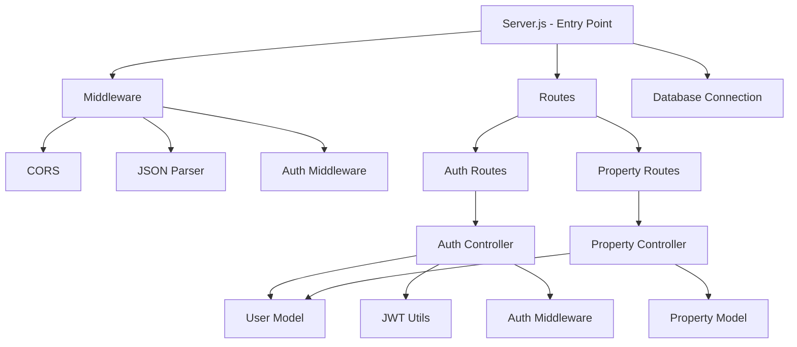

# LandGold App Architecture

## System Overview



## Mobile App Architecture



## Backend API Architecture



## Data Flow

### Authentication Flow
1. User enters phone number on Login screen
2. Mobile app calls Auth Service → API Utility → Backend /auth/send-otp
3. Backend generates/mock sends OTP and responds with success
4. User receives OTP and enters on OTP Verification screen
5. Mobile app calls Auth Service → API Utility → Backend /auth/verify-otp
6. Backend verifies OTP, creates JWT token, and responds with user data
7. Mobile app stores token in AsyncStorage and navigates to Main App

### Property Listing Flow
1. User opens Marketplace screen
2. Mobile app calls Property Service → API Utility → Backend /properties
3. Backend queries MongoDB for properties and responds with data
4. Mobile app transforms data and displays in UI

### Property Creation Flow
1. User creates new property
2. Mobile app calls Property Service → API Utility → Backend /properties (POST)
3. Auth Middleware validates JWT token
4. Backend creates new property in MongoDB and responds with data
5. Mobile app updates UI with new property

## Folder Structure

```
LandGoldApp/
├── backend/
│   ├── controllers/          # Request handlers
│   ├── middleware/           # Custom middleware functions
│   ├── models/               # Database models
│   ├── routes/               # API route definitions
│   ├── services/             # Business logic
│   ├── utils/                # Helper functions
│   ├── server.js             # Entry point
│   ├── package.json          # Backend dependencies
│   └── .env                  # Environment variables
│
├── components/               # Reusable UI components
│   ├── CustomButton.js
│   ├── CustomHeader.js
│   └── CustomInput.js
│
├── constants/                # Application constants
│   └── Colors.js
│
├── contexts/                 # React Context providers
│   └── AuthContext.js
│
├── screens/                  # Screen components
│   ├── SplashScreen.js
│   ├── Login.js
│   ├── OTPVerification.js
│   ├── MainApp.js
│   ├── Dashboard.js
│   ├── Marketplace.js
│   └── ... (other screens)
│
├── services/                 # Service layer
│   ├── authService.js
│   └── propertyService.js
│
├── utils/                    # Utility functions
│   └── api.js
│
└── App.js                    # Root component
```

This architecture provides a clean separation of concerns, making the application maintainable and scalable.